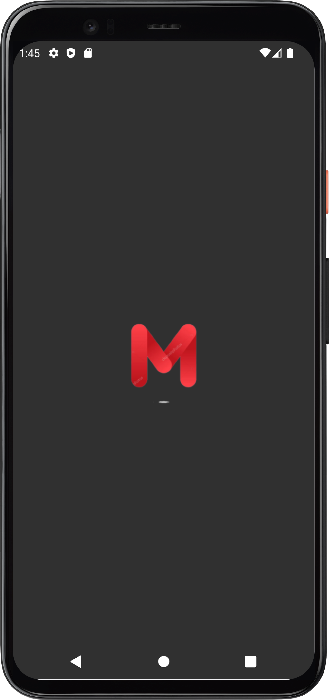
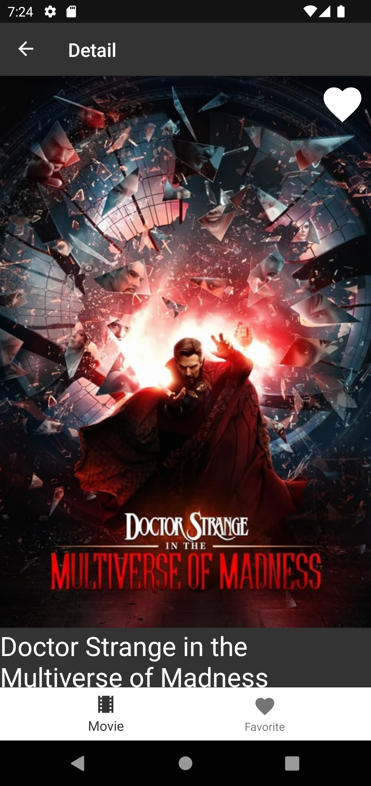
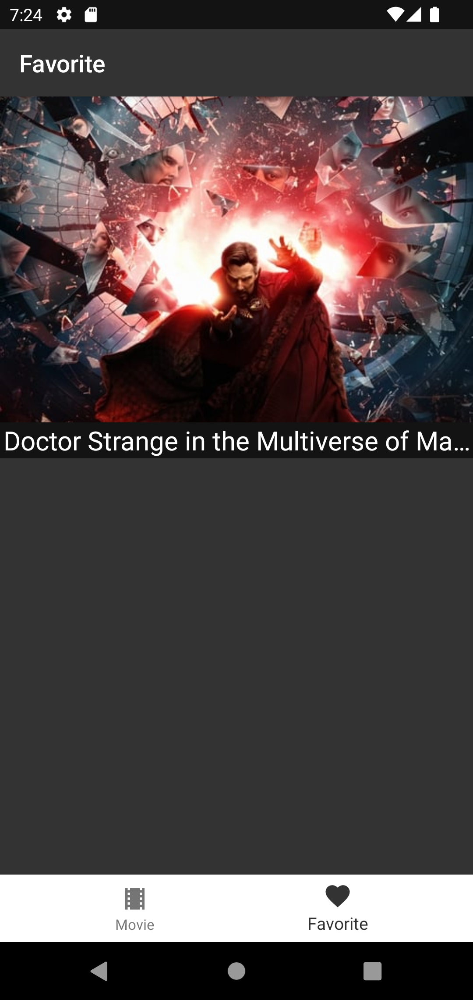

<!-- PROJECT LOGO -->
 

  

  <h3 align="center">Moviefy - Movie base app</h3>

  

    Based on TMDB API + Room, Retrofit, GSON
     
     
    <a href="https://github.com/Nura-21/AndrDEV-Moviefy">View Demo</a>
    ·
    <a href="https://github.com/Nura-21/AndrDEV-Moviefy/issues">Report Bug</a>
  

  
  
  
 Android-Spring-2022: <strong>Project of Movie base.</strong>
  
    

    

      
        
        
      
    
  

  
  
  This project made at Android Devolopment at KBTU, Spring 2022.
  Project: Simple Movie base from TMDB API with minimal features and MVVM structure. 
  LIBS: GSON, Retrofit, Glide, MVVM, Room
  
